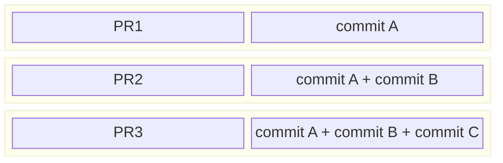

## Overview
Welcome to GitHub merge queue simulator.  This tool is designed to model the behavior of GitHub's merge queue and provide guidance on how to dial in various settings to optimize for throughput while balancing wait time and load on CI resources.

To use this tool effectively you need to know a few things about your PR workloads.  This information comes from observing your project and analysing historical data.  The things you need to know:

- Duration of the PR workload
- Average CI failure rate
- Target throughput

Once you have a good handle on what these numbers are, you can start simulating queue behavior.

Merge queue simulator is a python script that runs a large number of iterations which are meant to model GitHub's merge queue behavior using queue size, probability of failure, and randomly selecting queue position to fail a job.  The longer the duration, the more stable the predictions tend to be.  The tool computes PR throughput by tracking the number of successful PR moving through the queue over actual execution time (the last iteration may exceed allowed simulation duration).  Average wait time is computed using [Little's Law](https://en.wikipedia.org/wiki/Little%27s_law).

## Quickstart
Build the project:
```shell
poetry install
```

Run a simulation representing 250 hours of job executions, using queue sizes ranging from 5 to 10, where each job takes 30 minutes to execute, with a failure rate of 10%.
```shell
poetry run simulate --sim-duration 250 --min-queue-size 5 --max-queue-size 10 --job-duration 30 --failure-rate 0.1 
```

## Assumptions
The simulator makes a few assumptions.

- The queue is always full.
- Delays associated with manual re-submissions when a PR is rejected are not taken into account.

## How GitHub merge queue works
GitHub merge queue uses optimistic concurrency method to optimize for throughput.  The best way to understand how this works is to visualize a scenario where a queue is building multiple jobs at the same time and a failure occurs in the middle of the queue.  Let's consider a scenario with 3 PRs:
- `PR1` builds commit `A` which is its head commit.
- `PR2` builds commit `B`, and it includes `PR1`'s commit `A` anticipating `PR1` build success.
- `PR3` builds all commits `A` `B` and `C`.

Queue with 3 PRs:


When `PR2` build fails, it is removed from the queue, and all jobs that include its commit in the queue are restarted.
- `PR1` is unaffected.
- `PR2` build is removed from the queue.
- `PR3` build is restarted with commits `A` and `C`, no commit `B`.

Queue goes to 2 PRs:


