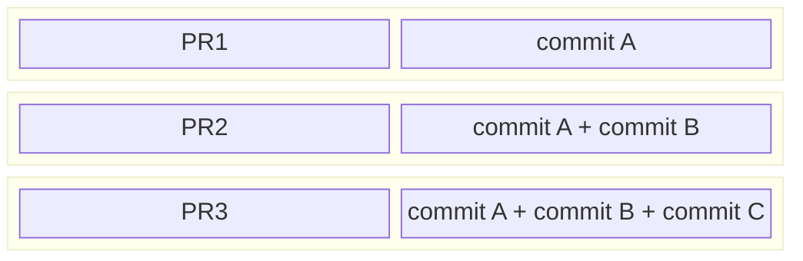
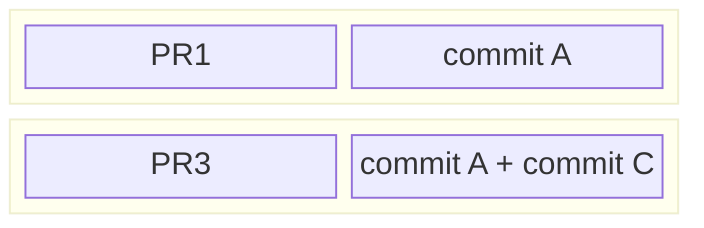

<p align="center">
  
</p>
<h2 align="center">GitHub Merge Queue Simulator</h2>

## Overview
Welcome to GitHub merge queue simulator.  This tool is designed to model the behavior of GitHub's merge queue and provide guidance on how to dial in various settings to optimize for throughput while balancing wait time and load on CI resources.

To use this tool effectively you need to know a few things about your PR workloads.  This information comes from observing your project and analysing historical data.  The things you need to know:

- Duration of the PR workload
- Average CI failure rate
- Target throughput

Once you have a good handle on what these numbers are, you can start simulating queue behavior.

Merge queue simulator is a python script that runs a large number of iterations which are meant to model GitHub's merge queue behavior using queue size, probability of failure, and randomly selecting queue position to fail a job.  The longer the duration, the more stable the predictions tend to be.  The tool computes PR throughput by tracking the number of successful PR moving through the queue over actual execution time (the last iteration may exceed allowed simulation duration).  Average wait time is computed using [Little's Law](https://en.wikipedia.org/wiki/Little%27s_law).

## Quickstart
Build the project:
```shell
poetry install
```

The following shows an example of tuning the queue size to determine optimal configuration for sufficient throughput and reduce wait times.

> [!TIP]  
> This scenario demonstrates how oversizing the queue can increase wait times for some workloads and increase cost on CI side.

**Simulation 1:** Run a simulation with the following parameters to get a baseline:
- queue size of `5`
- each job takes `30 minutes` to execute
- job probability of failure at `10%`
- no jobs waiting to enter the queue at any time

```shell
poetry run simulate --min-queue-size 5 --max-queue-size 5 --job-duration 30 --failure-probability 0.1
```
```
  Job duration : 30m
  Job failure probability : 0.1
  Jobs waiting to enter the queue probability : 0
  Jobs waiting to enter the queue : 0
  Simulation duration : 10000h
  
  Q Size | Throughput (PR/h) | Avg Time to Merge (m) | Median Time to Merge (m) | PRs Lost (PR/h)
  -------|-------------------|-----------------------|--------------------------|-----------------
  5      | 7.3               | 48.6                  | 30.0                     | 2.7
```

**Simulation 2:** Run a second simulation that shrinks the queue size by 2 and puts the 2 jobs into the waiting line with a small probability of that occuring:
- queue size of `3`
- each job takes `30 minutes` to execute (same)
- job probability of failure at `10%` (same)
- assign `10%` probability of `2` jobs waiting extra time to enter the queue, representing the reduction in the queue size shifted to queue waiting line

```shell
poetry run simulate --min-queue-size 3 --max-queue-size 3 --job-duration 30 --failure-probability 0.1 --jobs_waiting_to_enter 2 --jobs_waiting_to_enter_probability 0.1
```
```
  Job duration : 30m
  Job failure probability : 0.1
  Jobs waiting to enter the queue probability : 0.1
  Jobs waiting to enter the queue : 2
  Simulation duration : 10000h
  
  Q Size | Throughput (PR/h) | Avg Time to Merge (m) | Median Time to Merge (m) | PRs Lost (PR/h)
  -------|-------------------|-----------------------|--------------------------|-----------------
  3      | 4.9               | 40.0                  | 30.0                     | 1.1
```

> [!NOTE]  
> - There is an expected reduction in throughput due to smaller queue size.
> - There's also a significant drop in the average wait time.
> - The median number staying the same suggests most workloads are not impacted but few workloads are likely to see an improvement in wait times.
> - There's a significat drop in lost PRs which reduces cost in the CI system.

## How GitHub merge queue works
GitHub merge queue uses optimistic concurrency method to optimize for throughput.  The best way to understand how this works is to visualize a scenario where a queue is building multiple jobs at the same time and a failure occurs in the middle of the queue.  Let's consider a scenario with 3 PRs:
- `PR1` builds commit `A` which is its head commit.
- `PR2` builds commit `B`, and it includes `PR1`'s commit `A` anticipating `PR1` build success.
- `PR3` builds all commits `A` `B` and `C`.

Queue with 3 PRs:


When `PR2` build fails, it is removed from the queue, and all jobs that include its commit in the queue are restarted.
- `PR1` is unaffected.
- `PR2` build is removed from the queue.
- `PR3` build is restarted with commits `A` and `C`, no commit `B`.

Queue goes to 2 PRs:


